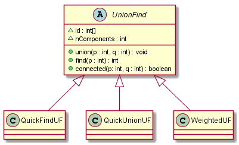

# Cap 1 - caso di studio : union find

## Diagramma delle classi

## Descrizione

Si ha un insieme e una sua partizione, e si vogliono studiare le operazioni significative (non reversibili) sugli elementi della partizione.

Si immagina che gli elementi della partizione siano in biiezione con i numeri naturali. Inizialmente ogni numero naturale rappresenta un elemento della partizione; sono inoltre presenti N componenti: ogni elemento appartiene al suo proprio componente (o equivalentemente ogni componente contiene uno ed un solo elemento). Una operazione di `union` rende due elementi qualsiasi appartenenti allo stesso componente; la cardinalità di un componente aumenta, i due elementi si dicono ora _connessi_, e il numero di componenti viene decrementato.

Ha quindi significato domandarsi a quale componente appartenga un determinato elemento. Si definisce quindi l'operazione `find`.

La terza operazione significativa è `connected`, che permette di determinare se due elementi appartengono allo stesso componente (i.e. sono connessi)

`UnionFind` come classe astratta lascia aperte le implementazioni delle tre operazioni.

## Implementazioni

In via generale, si usa un array i cui indici sono gli elementi e i cui valori sono gli identificativi dei componenti ai quali gli elementi appartengono.

Le varie implementazioni differiscono nel modo di usare l'array.

### Classe `QuickFind`

Implementa l'operazione `find` in O(1). All'i-esimo indice si trova l'id del componente cui l'elemento appartiene.

La `union` prevede la scrittura esplicita dell'id del componente al quale l'elemento va unito. Se gli elementi `x` e `y` vanno uniti, detti `A` e  `B` i rispettivi componenti, allora scandendo l'array, ogni volta che si trova  `A` verrà sostituito con  `B` (la scelta di usare A o B è arbitraria).

### Classe `QuickUnion`

Più raffinata: invece di scrivere nell'array l'id del componente, si scrive l'indice dell'elemento collegato all'elemento specificato.

Per fissare meglio le idee

| 1 | 2 | 3 | 4 | 5 | 6 | 7 | 8 |
|---|---|---|---|---|---|---|---|
| 1 | 2 | 3 | 4 | 5 | 6 | 7 | 8 |

In questa condizione ogni elemento fa riferimento a sé stesso. Se ora si uniscono, ad esempio, 5 e 8, basterà dire che l'elemento 5 fa riferimento all'elemento 8, mentre l'elemento 8 continuerà a far riferimento a sé stesso. (vale anche il viceversa, SRdG)

| 1 | 2 | 3 | 4 | 5 | 6 | 7 | 8 |
|---|---|---|---|---|---|---|---|
| 1 | 2 | 3 | 4 | **8** | 6 | 7 | 8 |

Che è come dire _l'elemento 5 è nello stesso componente dell'elemento 8_. L'elemento 8, poiché ha un riferimento su sé stesso, viene interpretato come capostipite di un componente.

Questo complica leggermente l'operazione `find`, che ora consiste nel risalire la struttura (sembrerà un albero) fino ad incontrare un elemento che ha come riferimento sé stesso.

Discorso analogo per l'operazione `connected`, che si risolve nel controllo `connected(x, y) <==> find(x) == find(y)`, ossia: gli elementi x e y sono connessi se e solo se hanno lo stesso capostipite.

### Classe `WeightedUF`

Raffina il QuickUnion tenendo traccia del "peso" di ogni nodo. Il peso di un nodo è il numero di nodi che hanno quel nodo come capostipite. All'inizio tutti i nodi hanno peso 1. Nel momento in cui un nodo diventa capostipite di un altro nodo, questi aggiunge al proprio peso il peso dell'altro nodo. In questo modo si cerca di bilanciare il più possibile la struttura ad albero che si crea, in modo da ottimizzare l'operazione `find`.

Si ottimizza l'operazione `union` agganciando sempre il nodo più "leggero" al nodo più "pesante".
